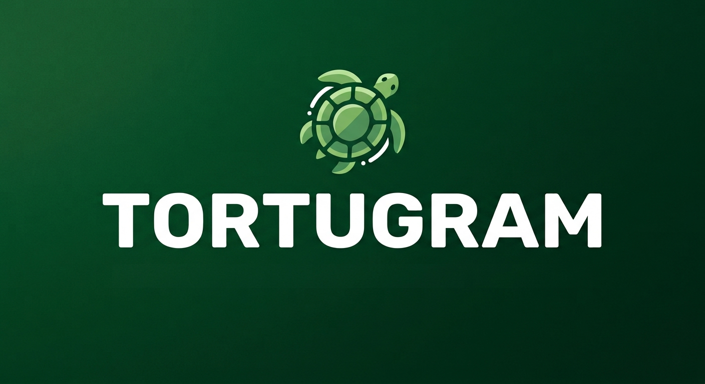

# 🐢 Tortugram

**A specialized Telegram streaming client designed for Amazon Fire TV.**  
*Un cliente de Telegram especializado en streaming de video para dispositivos Amazon Fire TV.*

---

[English](#english) • [Español](#español)

---

## 🇬🇧 English

### Overview
**Tortugram** is an open-source Android client powered by the Telegram API, specifically built to transform your Telegram media library into a seamless video streaming experience. By filtering out general text and clutter, Tortugram surfaces exclusively the video content from your chats, channels, and groups.

Engineered exclusively for remote-control navigation on **Amazon Fire TV Stick** devices.

### Key Features
* 🎬 **Video-Only Focus:** Automatically filters your Telegram ecosystem to present only video media.
* 📺 **Fire TV Optimization:** Designed exclusively for Amazon Fire TV Stick with remote control navigation.
* ⚡ **Instant Streaming:** Watch your media content via direct streaming without waiting for full local downloads.
* 🌐 **Full Access:** Seamlessly browse videos across all your personal chats, joined groups, and subscribed channels.
* 🔓 **100% Open Source:** Free, transparent, and open for community enhancements.

### Release Notes (v4.0.0)
* **Multilingual Support:** Added support for English (`values-en`), Portuguese (`values-pt`), French (`values-fr`), Russian (`values-ru`), Chinese (`values-zh`), Hindi (`values-hi`), and Japanese (`values-ja`).
* **New Features & Improvements:**
  * Implementation of a new cache management system.
  * Updated color palette across the user interface.
  * Enhanced video player controls, adding new buttons to restart playback, skip to the next video, or return to the previous video.
* **Dependency Updates:** Updated TDLib to version 1.8.66.

### Download & Installation
Get the latest build directly from the releases section:
👉 **[Download Tortugram v4.0.0 APK](https://github.com/Isaac-maker/Tortugram/releases/tag/v4.0.0)**

### Contributing
Tortugram is an open-source initiative. Contributions, feature requests, and pull requests are welcome to help expand and refine future releases.

*Developed with passion by [@Isaac-maker](https://github.com/Isaac-maker).*

---

## 🇪🇸 Español

### Descripción
**Tortugram** es un cliente de Android de código abierto impulsado por la API de Telegram, diseñado para transformar tu biblioteca multimedia en una experiencia fluida de streaming de video. Al filtrar el texto y elementos secundarios, la aplicación destaca exclusivamente el contenido en video de tus chats, canales y grupos.

Diseñada exclusivamente para navegación mediante control remoto en dispositivos **Amazon Fire TV Stick**.

### Características Principales
* 🎬 **Enfoque Exclusivo en Video:** Filtra automáticamente tu contenido de Telegram para mostrar únicamente archivos de video.
* 📺 **Optimizado para Fire TV:** Interfaz diseñada exclusivamente para Amazon Fire TV Stick y uso con control remoto.
* ⚡ **Reproducción en Streaming:** Disfruta de tu contenido multimedia de forma directa sin esperar descargas completas.
* 🌐 **Acceso Integral:** Navega por los videos disponibles en tus chats privados, grupos y canales suscritos.
* 🔓 **Código Abierto:** Proyecto libre, transparente y abierto a contribuciones de la comunidad.

### Notas de la versión (v4.0.0)
* **Soporte multilingüe:** Se ha añadido compatibilidad con Inglés (`values-en`), Portugués (`values-pt`), Francés (`values-fr`), Ruso (`values-ru`), Chino (`values-zh`), Hindi (`values-hi`) y Japonés (`values-ja`).
* **Nuevas características y mejoras:**
  * Implementación de un sistema optimizado para la gestión de memoria caché.
  * Actualización en la paleta de colores de la interfaz de usuario.
  * Rediseño de los controles del reproductor de video, integrando nuevos botones para reiniciar la reproducción, avanzar al siguiente video o regresar al anterior.
* **Mantenimiento de dependencias:** Actualización de TDLib a la versión 1.8.66.

### Descarga e Instalación
Obtén la última versión compilada desde el área de lanzamientos:
👉 **[Descargar APK de Tortugram v4.0.0](https://github.com/Isaac-maker/Tortugram/releases/tag/v4.0.0)**

### Contribuciones
Este es un proyecto de código abierto. Cualquier mejora, corrección o propuesta por parte de la comunidad es bienvenida.

*Desarrollado por [@Isaac-maker](https://github.com/Isaac-maker).*
